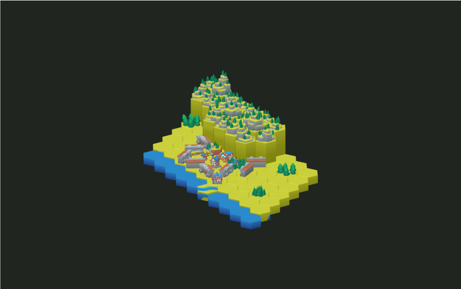
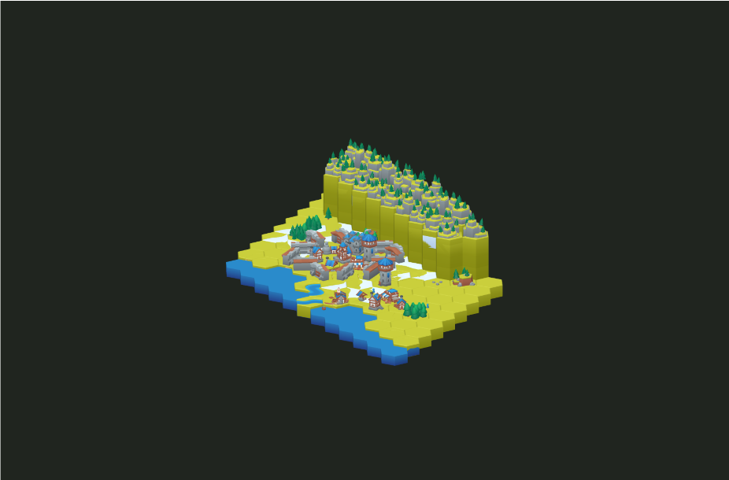

# Public API Guide

The package is a board runtime, not a file listing for GLTF assets. Most games
should flow through the same layers:

1. Load a manifest or app-local manifest bundle.
2. Build a `GameboardPlan` from a recipe, scenario, or seeded board request.
3. Validate assets, footprints, adjacency, spawn groups, patrol routes, and
   scenario references before rendering.
4. Instantiate a Koota runtime when live actors, quests, movement, systems, or
   mutations are needed.
5. Project the runtime into Three.js, React, a custom renderer, or another ECS.

## Subpaths

| Subpath | Use it for |
| --- | --- |
| `@jbcom/medieval-hexagon-gameboard` | Core manifests, seeded board creation, plan validation, selectors, and the runtime facade. |
| `@jbcom/medieval-hexagon-gameboard/actors` | Player, NPC, enemy, prop, collision, interaction-target, and actor-selection helpers. |
| `@jbcom/medieval-hexagon-gameboard/assets/free/*` | Published FREE GLTF, BIN, PNG, and manifest files for bundlers that need direct asset URLs. |
| `@jbcom/medieval-hexagon-gameboard/blueprint` | High-level 2.5D board blueprints for biome percentages, mountain ranges, towns, roads, rivers, harbors, ramps, bridges, and showcase recipes. |
| `@jbcom/medieval-hexagon-gameboard/catalog` | KayKit faction building ids, unit parts, prop ids, nature ids, texture names, typed asset-id constructors, public treatment metadata, extracted guide scenario metadata, scenario treatment joins, public API coverage joins, and coverage summaries for every FREE/EXTRA asset id. |
| `@jbcom/medieval-hexagon-gameboard/commands` | Renderer-click command planning, previews, and opt-in handler execution. |
| `@jbcom/medieval-hexagon-gameboard/compatibility` | External GLB/GLTF fit analysis, facing correction, placement recommendations, and spawn-option conversion. |
| `@jbcom/medieval-hexagon-gameboard/coordinates` | Axial coordinate keys, neighbors, ranges, paths, rotations, and deterministic coordinate selection. |
| `@jbcom/medieval-hexagon-gameboard/examples/simple-rpg-usage` | Compiled SimpleRPG usage example for consumer smoke tests and app reference code. |
| `@jbcom/medieval-hexagon-gameboard/examples/*.json` | Packaged recipe, scenario, and simulation JSON examples without exposing raw TypeScript example source. |
| `@jbcom/medieval-hexagon-gameboard/gameboard` | Neutral board plan construction, terrain stacks, roads, rivers, coasts, buildings, fortifications, construction sites, siege projectiles, units, and serialization. |
| `@jbcom/medieval-hexagon-gameboard/grid` | Honeycomb-compatible board grids, KayKit dimensions, world/axial conversion, pathfinding, and spawn locations. |
| `@jbcom/medieval-hexagon-gameboard/ingest` | Node/build-time source validation, FREE/EXTRA manifest generation, GLTF copying, and manifest module writing. |
| `@jbcom/medieval-hexagon-gameboard/interop` | Neutral ECS snapshots, relation indexes/selectors, and adapter mounting for non-Koota engines. |
| `@jbcom/medieval-hexagon-gameboard/koota` | Koota traits, relations, projections, actions, occupancy guards, and runtime placement snapshots. |
| `@jbcom/medieval-hexagon-gameboard/layout` | Archetypes, site inspection, percentage fills, scatter slots, footprints, and seeded placement generation. |
| `@jbcom/medieval-hexagon-gameboard/manifest/free` | The packaged FREE KayKit asset manifest. |
| `@jbcom/medieval-hexagon-gameboard/manifest/schema` | Manifest bundle validation, lookup, URL resolution, and app-local FREE/EXTRA manifests. |
| `@jbcom/medieval-hexagon-gameboard/movement` | Movement profiles, path requests, movement budgets, range queries, budget resets, and frame-loop stepping. |
| `@jbcom/medieval-hexagon-gameboard/navigation` | Terrain-aware pathfinding, movement ranges, spawn-group planning, and patrol-route planning. |
| `@jbcom/medieval-hexagon-gameboard/occupancy` | Placement footprint keys, occupancy indexes, and movement-blocking footprint semantics. |
| `@jbcom/medieval-hexagon-gameboard/patrol` | Patrol agents and route execution inside the same movement system. |
| `@jbcom/medieval-hexagon-gameboard/pieces` | Reusable declarations for external buildings, props, units, landmarks, and scatter assets. |
| `@jbcom/medieval-hexagon-gameboard/projection` | Lightweight Koota world projection back into serializable gameboard plans and validation plans. |
| `@jbcom/medieval-hexagon-gameboard/quests` | Reach, interaction, collision, and defeat quest objectives. |
| `@jbcom/medieval-hexagon-gameboard/react` | React provider, query hooks, actions, tile-scoped actor/occupancy reads, layout/piece previews, runtime snapshots, and runtime-aware UI helpers. |
| `@jbcom/medieval-hexagon-gameboard/recipe` | Serializable board intent for saved maps, editors, and generated plans. |
| `@jbcom/medieval-hexagon-gameboard/registry` | Custom hex tile declarations, adjacency/stack rules, KayKit geometry analysis, and declaration application. |
| `@jbcom/medieval-hexagon-gameboard/rules` | Seeded generation helpers, density fills, piece-fill inspection, and compatibility re-exports for generation workflows. |
| `@jbcom/medieval-hexagon-gameboard/rule-types` | Shared validation rule config and violation types without runtime code. |
| `@jbcom/medieval-hexagon-gameboard/runtime` | One-object game-loop facade for Koota state, actors, quests, commands, systems, pieces, scenarios, and interop. |
| `@jbcom/medieval-hexagon-gameboard/scenario` | Recipes plus actors, spawn groups, patrols, movement, and quests. |
| `@jbcom/medieval-hexagon-gameboard/selectors` | Guide-defined road, river, coast, edge-mask, rotation, and permutation selectors. |
| `@jbcom/medieval-hexagon-gameboard/simulation` | Headless scenario scripts and deterministic integration-test logs. |
| `@jbcom/medieval-hexagon-gameboard/systems` | Game-loop helpers for commands, patrols, movement, quests, and target dispatch. |
| `@jbcom/medieval-hexagon-gameboard/three` | Asset URL resolution, GLTF loading, transform sync, raycast lookup, and animation clip metadata. |
| `@jbcom/medieval-hexagon-gameboard/types` | Shared manifest, edition, category, faction, texture, coordinate, and shape types plus runtime constants. |
| `@jbcom/medieval-hexagon-gameboard/validation` | Koota-free plan, declaration, stack, adjacency, asset, recipe, and scenario validation boundaries. |
| `@jbcom/medieval-hexagon-gameboard/world-rules` | Lightweight Koota runtime predicates and validation helpers without seeded generation imports. |

## Plan Versus Runtime

`GameboardPlan` is the portable format. It is the right object for:

- Saved maps.
- AI-authored board JSON.
- build-time validation.
- renderer input.
- interop with engines that do not use Koota.

The Koota runtime is the live simulation surface. Use it when a game needs:

- actors and actor-aware movement.
- runtime placement spawn, move, update, or removal.
- footprint occupancy that changes during play.
- patrols, quests, commands, or frame-loop systems.
- live snapshots for another ECS.

```ts
import {
  createGameboardRuntimeFromScenario,
} from '@jbcom/medieval-hexagon-gameboard';
import simpleRpgScenario from '@jbcom/medieval-hexagon-gameboard/examples/simple-rpg-scenario.json';

const runtime = createGameboardRuntimeFromScenario(simpleRpgScenario);

const startTile = runtime.inspectTile('0,0');
const nearbyThreats = runtime.selectActors({
  sourceActor: 'player',
  hostileToSource: true,
  radius: 4,
});
```

## Board Blueprints

Use `./blueprint` when a game, editor, or agent should describe the whole board
instead of every tile. `createMedievalGameboardBlueprintRecipe` compiles
water/coast fill, stacked mountain ranges, towns, road networks, rivers,
harbors, biome texture percentages, transition tiles, elevation ramps, sloped
roads, bridges, and optional density fills into ordinary recipe JSON.
`createMedievalGameboardBlueprintPlan` immediately compiles that recipe to a
`GameboardPlan`; `inspectMedievalGameboardBlueprint` returns counts and
warnings for authoring UIs and CI.

```ts
import { createMedievalShowcaseBlueprintRecipe } from '@jbcom/medieval-hexagon-gameboard/blueprint';
import { createGameboardPlanFromRecipe } from '@jbcom/medieval-hexagon-gameboard/recipe';

const recipe = createMedievalShowcaseBlueprintRecipe();
const plan = createGameboardPlanFromRecipe(recipe);
```





The browser suite renders `free-blueprint-builder-showcase.png` and
`extra-blueprint-biome-transition-showcase.png` so the public API proves board
composition visually, not just through unit assertions.

For fixed maps, use `GameboardBuilder.addElevationRamp` or the serializable
`addElevationRamp` recipe action when an elevation change needs an explicit
sloped tile, and use `GameboardBuilder.addBridge` or recipe `addBridge` when a
road crossing needs a specific bridge variant instead of relying on blueprint
inference. Use `GameboardBuilder.addFortification`, `addConstructionSite`, and
`addSiegeProjectile` or their recipe actions for authored walls, fences, gates,
ruins, scaffolding, staged construction, and neutral catapult projectiles.

The CLI exposes the same compiler for agents, editors, and build pipelines:

```bash
medieval-hexagon-gameboard blueprint \
  --blueprint examples/blueprint-board.json \
  --outRecipe campaign.recipe.json \
  --outPlan campaign.plan.json \
  --out campaign.inspection.json \
  --allowUnknownAssets
```

## Runtime Facade

Use `./runtime` when application code wants one game-loop object instead of
coordinating individual subpaths. The facade keeps the Koota world available
while exposing safe helpers for the common loops:

- inspect a tile or neighborhood.
- select or target actors.
- preview and execute commands.
- preview navigation, occupancy, spawn groups, and patrol routes from live
  runtime state.
- inspect placement occupancy and spawn, update, move, or remove runtime
  placements.
- register, update, find, and read actor state attached to placements, including
  tile-scoped actor reads for UI and collision probes.
- spawn, find, read, and advance quests against live actor state.
- inspect layout sites, preview generated placement/fill options, and spawn
  declared pieces or generated layout fills.
- advance patrol, movement, command, actor-target, and quest systems.
- project the board to a `GameboardPlan`.
- emit or mount interop snapshots.

This is the recommended boundary for a game UI, editor preview, or integration
test. Lower-level subpaths stay public for engines that want tighter control.
See [Runtime Integration](./runtime-integration.md) for the scene ownership,
tick-loop, React, external ECS, and integration-test patterns.

## Custom Packs

External assets should be modeled as declarations before they are placed. This
keeps compatibility warnings, scale, footprint, source attribution, and default
placement criteria reusable.

```ts
import { analyzeExternalAssetCompatibility } from '@jbcom/medieval-hexagon-gameboard/compatibility';
import { createGameboardLayoutArchetypeRegistry } from '@jbcom/medieval-hexagon-gameboard/layout';
import { declareGameboardPieceFromCompatibility } from '@jbcom/medieval-hexagon-gameboard/pieces';

const report = analyzeExternalAssetCompatibility({
  id: 'kenney-round-tower',
  sourcePack: 'Kenney Castle Kit',
  intendedRole: 'tile',
  bounds: {
    min: [-1.15, 0, -1.15],
    max: [1.15, 4.8, 1.15],
    size: [2.3, 4.8, 2.3],
  },
});

const archetypes = createGameboardLayoutArchetypeRegistry({
  'round-tower': {
    id: 'round-tower',
    label: 'Round Tower',
    kind: 'structure',
    criteria: {
      terrain: ['grass', 'road'],
      footprint: { kind: 'adjacent', edges: [0, 1], includeCenter: true },
      allowOccupied: false,
    },
  },
});

const tower = declareGameboardPieceFromCompatibility(report, {
  role: 'landmark',
  archetype: 'round-tower',
  metadata: { sourceUrl: '/assets/kenney/round-tower.glb' },
});
```

If an external mesh looks unlike a KayKit hex tile, the compatibility report
should not force it into tile rules. Prefer declaring it as a prop, landmark,
building, tree, scatter asset, or unit with explicit placement criteria.

## Validation Boundaries

| Boundary | Public helper |
| --- | --- |
| Manifest shape and stale indexes | `inspectMedievalHexagonManifest` |
| Asset exists but lacks an intentional public API route | `listKayKitAssetPublicTreatments`, `describeKayKitAssetTreatment` |
| Extracted guide page, asset id, or gameplay role lacks asset/API/docs/visual coverage | `listKayKitGuideScenarios`, `describeKayKitGuideScenario`, `listKayKitGuideScenarioTreatments`, `describeKayKitGuideScenarioCoverage`, `listKayKitGuideAssetCoverages`, `describeKayKitGuideAssetCoverage`, `listKayKitGuideRoleCoverages`, `describeKayKitGuideRoleCoverage`, `listKayKitGuidePublicApiCoverages`, `describeKayKitGuidePublicApiCoverage`, `summarizeKayKitGuideCoverage`, `renderKayKitGuideScenarioCoverageMarkdown` |
| Packaged or app-local manifest lookup | `createManifestBundle`, `getManifestAsset` |
| Missing assets in plans, recipes, and scenarios | `validateGameboardPlan`, recipe/scenario validation helpers |
| Tile declarations and neutral plan rules | `validateGameboardPlan` |
| Koota world rules | `validateGameboardRules` |
| Layout candidate analysis | `inspectGameboardLayoutSites`, `analyzeGameboardLayoutFill` |
| Piece placement previews | `inspectGameboardPiecePlacement` |
| Runtime footprint blockers | `inspectGameboardPlacementOccupancy` |
| Actor collision and interactions | `inspectGameboardActorCollision`, `inspectGameboardInteractionTarget` |
| Scenario scripts | `validateGameboardScenarioSimulationScript` |

Use the earliest boundary that has enough information. For example, validate a
scenario before rendering, then use runtime occupancy guards for mutations that
depend on the current live board.
